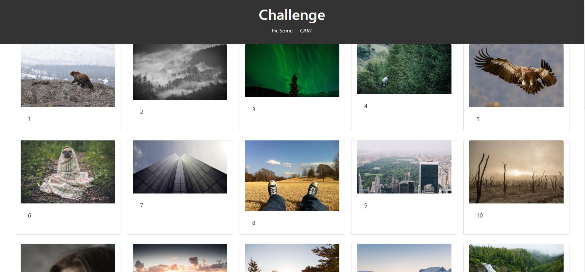

<h1>Parhako Challenge</h1>

I did this challenge as much as I could do in a day. It was my first time working with only Function Based Components in React.

Created Component of <b>Cart</b> and <b>Photos</b>, placed the in the Pages Folder and setup a Router

Then I created a <b>NavigationBar</b> to navigate between pages

After this, I setup the <b>Context</b> for my App. At first, I passed an empty string as directed in the challenge. After then, I decided to pass the actual state throught the ContextApi

Now, in the <b>Photos</b> section, this is how the images looked.

The console.log was responding whenever I <b>hovered</b> my mouse  over the pictures.

When I hovered my mouse over the pictures, the heart and add icon would come up

<b>This is the extent to which I completed the challenge</b>
